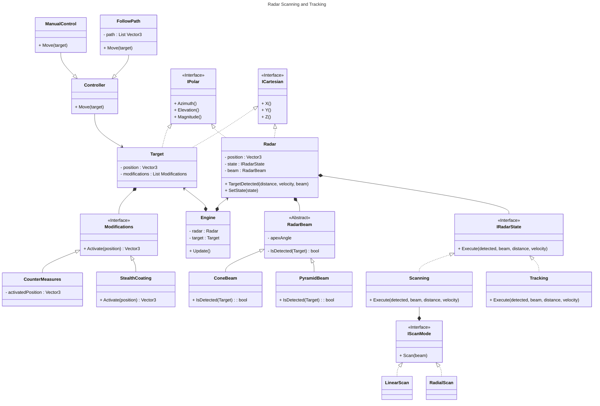

# Radar Scanning and Tracking

## Legend

- Azimuth - angle around Z axis
- Elevation - angle from XY plane

## UML

```mermaid
---
title: Radar Scanning and Tracking
---
classDiagram

ManualControl --|> Controller
IPolar <|.. Target
ICartesian <|.. Target
IPolar <|.. Radar
ICartesian <|.. Radar
FollowPath --|> Controller

Controller --> Target

Target *-- Modifications
Target <--* Engine
Radar <--* Engine
Radar *-- RadarBeam 
Radar *-- IRadarState 

RadarBeam <|-- ConeBeam
RadarBeam <|-- PyramidBeam

Modifications <|-- CounterMeasures
Modifications <|-- StealthCoating

IRadarState <|.. Scanning
IRadarState <|.. Tracking

Scanning --* IScanMode 
IScanMode <|.. LinearScan
IScanMode <|.. RadialScan

class ConeBeam {
  + IsDetected(Target) : bool
}

class PyramidBeam {
  + IsDetected(Target) : bool
}

class Controller {
  + Move(target)
}

class FollowPath {
  - path : List Vector3

  + Move(target)
}

class ManualControl {
  + Move(target)
}

class Target {
  - position : Vector3
  - modifications : List Modifications
}

class Modifications {
  <<Interface>>
  + Activate(position) Vector3
}

class CounterMeasures {
  - activatedPosition : Vector3
}

class StealthCoating {
  + Activate(position) Vector3
}

class Radar{
  - position : Vector3
  - state : IRadarState
  - beam : RadarBeam
  + TargetDetected(distance, velocity, beam)
  + SetState(state)
}

class IRadarState {
  <<Interface>> 
  + Execute(detected, beam, distance, velocity)
}

class Scanning {
  + Execute(detected, beam, distance, velocity)
}

class Tracking {
  + Execute(detected, beam, distance, velocity)
}

class IScanMode {
  <<Interface>> 
  + Scan(beam)
}

class LinearScan {
  
}

class Engine {
  - radar : Radar
  - target : Target
  + Update()
}

class IPolar {
  <<Interface>>
  + Azimuth()
  + Elevation()
  + Magnitude()
}

class ICartesian {
  <<Interface>>
  + X()
  + Y()
  + Z()
}

class RadarBeam{
  <<Abstract>>
  - apexAngle

  - IsDetected(Target) bool
}

```
